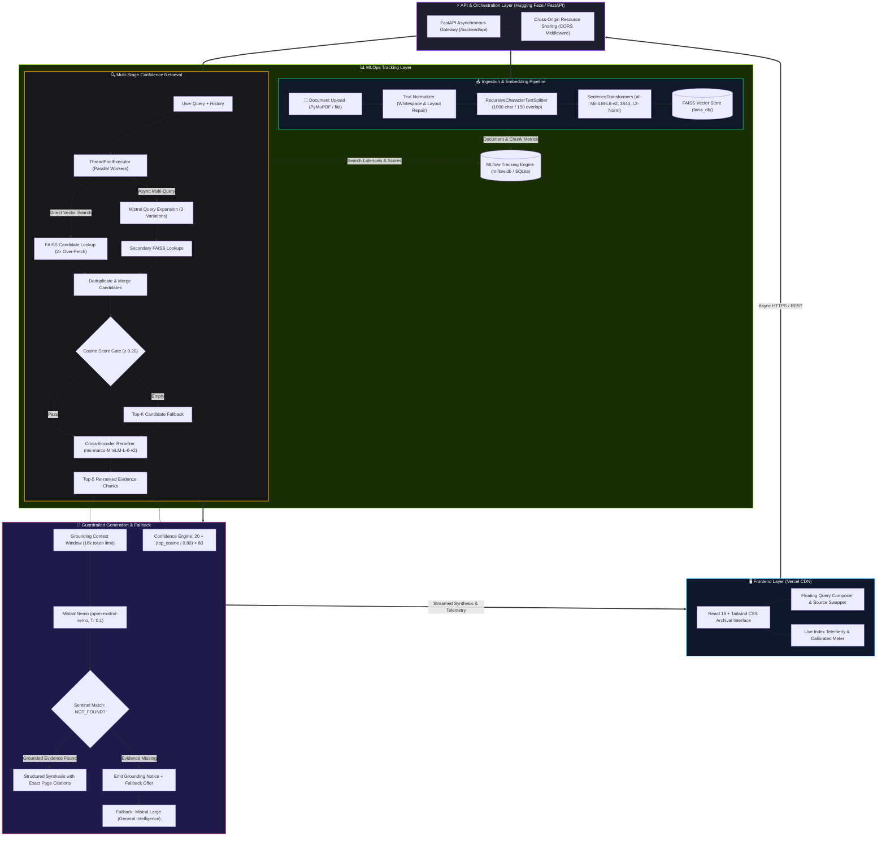

<div align="center">

# 🧠 VIORA
### **Grounded Research & Retrieval Assistant**
**A Production-Grade, Decoupled Full-Stack RAG System Engineered for Zero-Hallucination Grounding, Calibrated Confidence Scoring, and Autonomous Fallbacks.**

[](https://vioraassistant.vercel.app)
[](https://huggingface.co/spaces/djShashi/Viora-Assistance)
[](https://djshashi-viora-assistance.hf.space/backend/api/status)
[](https://github.com/kumarvishal10351/VIORA-Assistant)

<p align="center">
  
  
  
  
  
  
  
  
  
  
  
</p>

[**Explore Live Demo**](https://vioraassistant.vercel.app) • [**Hugging Face Space**](https://huggingface.co/spaces/djShashi/Viora-Assistance) • [**Architecture**](#-system-architecture) • [**Key Features**](#-key-features) • [**RAG Deep Dive**](#-deep-dive-the-5-stage-retrieval-pipeline) • [**API Docs**](#-rest-api-reference) • [**Local Setup**](#-local-development-quick-start)

</div>

---

## 🎯 Executive Summary (For Hiring Managers & Recruiters)

**VIORA** is an enterprise-grade, full-stack Retrieval-Augmented Generation (RAG) platform designed to eliminate the systemic reliability defects of traditional RAG systems: **hallucinations, blind context injection, lack of quality signals, and silent failure on out-of-domain inquiries.**

### Key Engineering Highlights:
- **Decoupled Architecture**: High-speed **React 19** frontend deployed on **Vercel edge network**, communicating via asynchronous REST APIs with a **FastAPI + Gradio** backend hosted on **Hugging Face Spaces** accelerated by **Nvidia ZeroGPU (RTX Pro 6000 Blackwell)**.
- **5-Stage Guardrailed Retrieval Pipeline**: Combines **Parallel Multi-Query LLM Expansion**, **$L_2$-Normalized Dense Embeddings**, **Cosine Threshold Gating ($\ge 0.20$)**, **Joint-Attention Cross-Encoder Reranking**, and **Strict Zero-Speculation Prompting**.
- **Calibrated Confidence Engine**: Proprietary mathematical formula mapping raw cosine similarities into an intuitive $0\text{--}100\%$ factual grounding score, giving users full transparency over retrieval quality.
- **Zero-Speculation Sentinel & Autonomous Fallback**: If retrieved passages lack sufficient evidence, the system returns a deterministic `NOT_FOUND` sentinel and seamlessly routes to **Mistral Large** for general knowledge synthesis.
- **Full MLOps Instrumentation**: Built-in tracking with **MLflow** recording document parsing latencies, chunk volume, token distributions, and retrieval scores into `mlflow.db`.

---

## 🌐 Live Deployments & Interactive Links

| Component | Platform | URL | Status |
| :--- | :--- | :--- | :--- |
| **Production Frontend** | Vercel Edge | [**vioraassistant.vercel.app**](https://vioraassistant.vercel.app) |  |
| **Backend & Space UI** | Hugging Face Spaces | [**huggingface.co/spaces/djShashi/Viora-Assistance**](https://huggingface.co/spaces/djShashi/Viora-Assistance) |  |
| **Backend REST API** | HF Space (Port 7860) | [**djshashi-viora-assistance.hf.space/backend/api/status**](https://djshashi-viora-assistance.hf.space/backend/api/status) |  |
| **Source Repository** | GitHub | [**github.com/kumarvishal10351/VIORA-Assistant**](https://github.com/kumarvishal10351/VIORA-Assistant) |  |

---

## ⚖️ Traditional RAG vs. VIORA

| Capability | Naive / Traditional RAG | VIORA Platform |
| :--- | :--- | :--- |
| **Candidate Retrieval** | Single raw query vector lookup | **Parallel Multi-Query Expansion** (3 async variations + chat pronoun resolution) |
| **Cosine Gating** | ❌ None (blind dump of Top-$K$ noise) | ✅ **Cosine Threshold Gate ($\ge 0.20$)** with adaptive fallback |
| **Candidate Ranking** | Bi-Encoder similarity only (prone to drift) | ✅ **Cross-Encoder Reranker** (`ms-marco-MiniLM-L-6-v2`) via joint attention |
| **Hallucination Control** | High hallucination risk when answer is missing | ✅ **Strict Grounding Guardrails** + deterministic `NOT_FOUND` sentinel |
| **Confidence Scoring** | ❌ None (black-box generation) | ✅ **Calibrated $0\text{--}100\%$ Metric** with visual confidence indicator |
| **Out-of-Domain Query** | Silent confabulation / fabricated facts | ✅ **Interactive Fallback** to Mistral Large ($T=0.7$) on demand |
| **Source Transparency** | Generic or non-existent citations | ✅ **Page-level citations**, chunk identifiers, and similarity match scores |
| **Experiment Tracking** | ❌ None | ✅ **Built-in MLflow** tracking ingestion, chunks, and latency metrics |
| **Architecture** | Monolithic local script | ✅ **Decoupled cloud-native microservice** (Vercel CDN + ZeroGPU Backend) |

---

## 🏗 System Architecture



---

## 🔬 Deep Dive: The 5-Stage Retrieval Pipeline

VIORA rejects naive similarity search in favor of a mathematically bounded, multi-stage retrieval architecture:

### 1. Parallel Multi-Query Expansion
User queries often suffer from vocabulary mismatch or implicit pronoun references (e.g., *"What were their primary findings?"*). VIORA runs an asynchronous `ThreadPoolExecutor` that queries `open-mistral-nemo` to produce 3 alternate semantic formulations informed by prior conversation turns.

### 2. $L_2$-Normalized Dense Embedding & Over-Fetch
Embeddings are computed via `all-MiniLM-L6-v2` with `normalize_embeddings=True`. Crucially, enforcing unit norm ensures that inner products calculated by FAISS equate strictly to cosine similarity in $[0, 1]$, preventing score distortion:
$$\cos(\mathbf{u}, \mathbf{v}) = \frac{\mathbf{u} \cdot \mathbf{v}}{\|\mathbf{u}\|_2 \|\mathbf{v}\|_2} = \mathbf{u}_{\text{norm}} \cdot \mathbf{v}_{\text{norm}}$$

The system queries $k \times 2$ candidates across all expanded queries, deduplicating chunks while preserving each chunk's highest semantic match.

### 3. Cosine Threshold Gating ($\ge 0.20$)
Irrelevant passages and noise are stripped out by a calibrated relevance floor ($\text{score} \ge 0.20$). If no passages clear the threshold (common with broad introductory inquiries), an adaptive fallback retains the top-$k$ candidates for further evaluation.

### 4. Cross-Encoder Joint-Attention Reranking
Bi-encoders embed queries and passages independently, missing cross-token interactions. VIORA feeds the filtered candidates into `cross-encoder/ms-marco-MiniLM-L-6-v2`. The model evaluates query-passage pairs jointly across all attention layers:
$$\text{Score}_{\text{CE}} = \text{CrossEncoder}([\text{Query}, \text{Passage}])$$

*Engineering safeguard:* Cross-encoder raw logits $(-\infty, +\infty)$ are used **strictly for candidate ordering**. They are never used for thresholding, isolating the pipeline from logit calibration drift.

### 5. Calibrated Confidence Scoring Formula
To provide enterprise users with a dependable reliability metric, VIORA transforms the top cosine score into an intuitive $0\text{--}100\%$ score:
$$\text{Confidence} = \min\left(100, \left\lfloor 20 + \frac{\text{top\_cosine}}{0.80} \times 80 \right\rfloor\right)$$

- $\text{top\_cosine} \ge 0.80 \implies \mathbf{100\%}$ (Rock-solid citation)
- $\text{top\_cosine} \approx 0.60 \implies \mathbf{80\%}$ (Strong relevance)
- $\text{top\_cosine} < 0.40 \implies \mathbf{\le 60\%}$ (Exploratory / Weak correlation)

---

## 🛠 Tech Stack & Engineering Specifications

| Layer | Technology | Version | Engineering Justification |
| :--- | :--- | :--- | :--- |
| **Frontend Framework** | **React** | `19.2.8` | Concurrent rendering, declarative hooks, stateful streaming response |
| **Build Tool** | **Vite** | `8.2.2` | Ultra-fast HMR, Rollup optimized code-splitting and asset minification |
| **Styling** | **Tailwind CSS** | `v4.3.3` | Modern JIT engine, CSS variable design tokens, responsive dark-mode styling |
| **Backend Framework** | **FastAPI** | `0.115+` | Native asynchronous endpoints, automatic OpenAPI/Swagger documentation |
| **ASGI Server** | **Uvicorn** | `0.30+` | High-performance ASGI server with uvloop event loops |
| **LLM Orchestration** | **LangChain** | `0.2+` | Clean abstraction for prompts, message histories, and vector retrieval chains |
| **Primary LLM** | **Mistral AI** | `open-mistral-nemo` | 128K context, high-precision reasoning, $T=0.1$ for zero-speculation |
| **Fallback LLM** | **Mistral AI** | `mistral-large-latest` | Frontier reasoning for out-of-domain knowledge queries ($T=0.7$) |
| **Embedding Model** | **Sentence-Transformers** | `all-MiniLM-L6-v2` | 384-dimensional dense vectors, fast CPU inference, lightweight 80MB footprint |
| **Vector Engine** | **FAISS CPU** | `1.8+` | Sub-millisecond vector similarity search, disk-persistent serialization |
| **Reranking Model** | **Cross-Encoder** | `ms-marco-MiniLM-L-6-v2`| Joint query-passage cross-attention, eliminates bi-encoder semantic drift |
| **Document Parser** | **PyMuPDF (`fitz`)** | `1.24+` | High-speed C-based PDF text extraction with layout and page retention |
| **Experiment Tracking**| **MLflow** | `3.1.0` | Local SQLite logging of ingestion parameters, chunk sizes, and latencies |
| **Cloud Hosting** | **Vercel + Hugging Face** | Edge + ZeroGPU | 100% serverless, zero-cost production infrastructure with Nvidia RTX Pro 6000 |

---

## ⚡ REST API Reference

The backend exposes a fully documented, CORS-enabled REST API:

### Base URL: `https://djshashi-viora-assistance.hf.space/backend`

| Method | Endpoint | Description | Request Body / Params |
| :--- | :--- | :--- | :--- |
| **`GET`** | `/api/status` | System health, indexed doc counts, and rolling confidence telemetry | None |
| **`GET`** | `/api/documents` | List all currently indexed PDF documents and sizes | None |
| **`POST`** | `/api/upload` | Upload, parse, chunk, and index a PDF file into FAISS | `multipart/form-data` (`file: .pdf`) |
| **`POST`** | `/api/query` | Execute 5-stage RAG query against the indexed documents | JSON: `{ "query": str, "history": list, "selected_doc": str }` |
| **`POST`** | `/api/fallback` | Query general-knowledge fallback model (Mistral Large) | JSON: `{ "query": str, "history": list }` |
| **`DELETE`** | `/api/documents` | Wipe all documents and reset the FAISS vector index | None |
| **`DELETE`** | `/api/documents/{name}`| Delete an individual document and re-index remainder | URL parameter: `filename` |

#### Sample Query Response:
```json
{
  "answer": "According to the document, the initiative focuses on collaborative applied intelligence...",
  "confidence": 94,
  "anchors": [
    "Anchor: [Document.pdf p. 2, Chunk #1]",
    "Anchor: [Document.pdf p. 4, Chunk #3]"
  ],
  "latency_ms": 1380,
  "sources": [
    {
      "file_name": "Document.pdf",
      "page": 2,
      "score": 0.812,
      "preview": "The initiative outlines key strategic objectives designed to foster..."
    }
  ],
  "can_fallback": false,
  "is_fallback": false
}
```

---

## 📊 MLOps & Experiment Tracking

VIORA includes comprehensive experiment telemetry powered by **MLflow**:

- **Telemetry Database**: Persistent SQLite store in `mlflow.db`.
- **Tracked Parameters**:
  - `embedding_model`: `all-MiniLM-L6-v2`
  - `vector_store`: `FAISS`
  - `chunk_size`: `1000` | `chunk_overlap`: `150`
- **Tracked Metrics**:
  - `document_size_kb`: Processed document size
  - `page_count`: Number of extracted pages
  - `load_time`: PyMuPDF extraction duration
  - `embedded_chunks`: Total vector chunks generated
  - `embedding_time`: Sentence-transformers embedding latency

### Launching MLflow Dashboard:
```bash
mlflow ui --backend-store-uri sqlite:///mlflow.db --port 5000
```
Open `http://localhost:5000` to visualize ingestion runs, latency metrics, and parameter logs.

---

## 🧪 Test Suite & Validation

The project maintains **17+ comprehensive test suites** covering unit, regression, and end-to-end functionality:

```bash
# Run the entire test suite
pytest -v
```

### Verified Test Areas:
- **`test_retrieval_pipeline.py`**: End-to-end verification of the 5-stage retrieval pipeline.
- **`test_confidence_regression.py`**: Validates mathematical score isolation between CrossEncoder logits and cosine similarities.
- **`test_embedding_normalization.py`**: Asserts that embedding vectors are strictly $L_2$-normalized to unit length.
- **`test_grounding_and_fallback.py`**: Tests `NOT_FOUND` sentinel triggering and fallback routing.
- **`test_loader_validation.py`**: Tests edge cases for PDF parsing (corrupt files, 0-byte PDFs, scan-only PDFs).
- **`test_mlflow_graceful_degradation.py`**: Confirms that API execution continues smoothly even if the telemetry tracking server is unreachable.

---

## 💻 Local Development Quick Start

### 1. Prerequisites
- Python 3.11+
- Node.js 18+ (for frontend development)
- Valid [Mistral AI API Key](https://console.mistral.ai/)

### 2. Repository Setup
```bash
# Clone the repository
git clone https://github.com/kumarvishal10351/VIORA-Assistant.git
cd VIORA-Assistant

# Create and activate Python virtual environment
python -m venv venv
# Windows:
venv\Scripts\activate
# Linux/macOS:
source venv/bin/activate

# Install backend dependencies
pip install -r requirements.txt

# Configure environment variables
cp .env.example .env
```

Add your API key inside `.env`:
```env
MISTRAL_API_KEY="your_actual_mistral_api_key_here"
```

### 3. Run Backend
```bash
# Start FastAPI backend server
uvicorn app.api:app --host 0.0.0.0 --port 8000 --reload
```

### 4. Run Frontend
```bash
cd frontend
npm install
npm run dev
```
Open `http://localhost:5173` to interact with the local development UI.

---

## 🐳 Docker Deployment

VIORA is containerized with multi-stage builds and persistent volume bindings:

```bash
# Run with Docker Compose
docker compose up --build -d

# View container logs
docker compose logs -f

# Stop container
docker compose down
```

---

## 📁 Repository Structure

```
rag-assistant/
├── app/
│   ├── api.py                     # FastAPI REST API & static routing
│   ├── main.py                    # Server launcher & CLI entrypoint
│   ├── chains/
│   │   ├── rag_chain.py           # 5-stage parallel retrieval & generation pipeline
│   │   └── router.py              # Hybrid distance & relevance routing
│   ├── config/
│   │   └── settings.py            # Environment configurations & threshold constants
│   ├── ingestion/
│   │   ├── loader.py              # PyMuPDF text extraction & layout normalizer
│   │   ├── splitter.py            # Recursive character chunking engine
│   │   └── embedder.py            # SentenceTransformers embedding & FAISS disk store
│   ├── llm/
│   │   ├── mistral_client.py      # Primary LLM client (open-mistral-nemo)
│   │   └── fallback.py            # Fallback general-knowledge client (mistral-large)
│   ├── retrieval/
│   │   └── retriever.py           # FAISS search, cosine filter & CrossEncoder reranker
│   └── utils/
│       ├── confidence.py          # Calibrated confidence mathematical model
│       └── mlflow_logger.py       # MLflow logging wrapper with graceful degradation
├── frontend/                      # React 19 + Tailwind CSS Archival Interface
│   ├── src/
│   │   ├── components/            # Stitch design system UI components
│   │   │   ├── Header.jsx         # Archival masthead & navigation
│   │   │   ├── TelemetryBar.jsx   # Live system telemetry indicators
│   │   │   ├── QueryComposer.jsx  # Floating query composer with keyboard shortcuts
│   │   │   ├── SynthesisMemo.jsx  # Structured answer synthesis with citations
│   │   │   └── UploadModal.jsx    # Drag-and-drop document indexing modal
│   │   ├── App.jsx                # Root application orchestration
│   │   └── config.js              # Centralized API base URL resolver
│   ├── dist/                      # Pre-compiled production bundle
│   └── package.json
├── app.py                         # Root entrypoint for Hugging Face Spaces (Gradio + FastAPI)
├── docker-compose.yml             # Container orchestration config
├── dockerfile                     # Multi-stage production container image
├── mlflow.db                      # Local SQLite tracking database
├── requirements.txt               # Pinned Python dependencies
└── tests/                         # Comprehensive Pytest test suite (17+ files)
```

---

## 👤 Author & Connect

**Kumar Vishal**  
*AI & Machine Learning Engineer | Generative AI & Full-Stack Systems*

- 🌐 **Portfolio / Live Project**: [vioraassistant.vercel.app](https://vioraassistant.vercel.app)
- 💼 **GitHub**: [github.com/kumarvishal10351](https://github.com/kumarvishal10351)
- 🤗 **Hugging Face**: [huggingface.co/djShashi](https://huggingface.co/djShashi)

---

## 📄 License

This project is licensed under the **MIT License** — see the [LICENSE](LICENSE) file for details.
