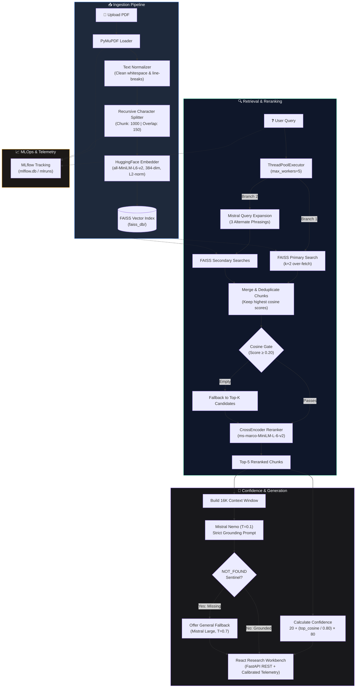

<p align="center">
  
</p>

<h1 align="center">AURA</h1>
<h3 align="center">Adaptive Unified Retrieval Assistant</h3>

<p align="center">
  <em>A production-grade, MLOps-instrumented Retrieval-Augmented Generation platform<br/>engineered for strict factual grounding, calibrated confidence scoring, and zero-hallucination fallbacks.</em>
</p>

<p align="center">
  <a href="https://github.com/kumarvishal10351/-AURA-Adaptive-Unified-Retrieval-Assistant/actions"></a>
  
  
  
  
  
  
  
  
  
  
  
</p>

<p align="center">
  <a href="#-overview">Overview</a> •
  <a href="#-key-features">Features</a> •
  <a href="#-system-architecture">Architecture</a> •
  <a href="#-end-to-end-workflow">Workflow</a> •
  <a href="#-project-structure">Project Structure</a> •
  <a href="#-technology-stack">Stack</a> •
  <a href="#-quick-start">Quick Start</a> •
  <a href="#-deep-dive-retrieval-pipeline">Retrieval Pipeline</a> •
  <a href="#-mlops--experiment-tracking">MLOps</a> •
  <a href="#-architectural-blueprint--roadmap">Enterprise Blueprint</a>
</p>

---

## 🔍 Overview

**AURA** (Adaptive Unified Retrieval Assistant) is an end-to-end, enterprise-ready Retrieval-Augmented Generation (RAG) platform specifically designed to eliminate the systemic reliability defects of traditional RAG pipelines.

### The Problem with Traditional RAG

Most baseline RAG implementations follow a simplistic flow: convert documents to embeddings, query top-$k$ nearest neighbors, and dump raw chunks into an LLM prompt. In production, this causes three critical failure modes:

1. **Blind Context Injection**: Retrieved chunks are sent to the LLM regardless of semantic relevance, forcing the model to confabulate answers from noise.
2. **Missing Quality Signals**: Responses are returned without confidence metrics or relevance guarantees, leaving users unaware if an answer is an accurate quotation or a hallucination.
3. **Catastrophic Degradation**: When a document does not contain an answer, typical systems either hallucinate fabricated facts or crash with uninformative errors.

### How AURA Solves This

AURA implements a **multi-stage, confidence-aware decision layer** that verifies, filters, and reranks candidate passages before passing them to the generator:

* **Parallel Multi-Query Expansion**: Uses an asynchronous `ThreadPoolExecutor` to expand user queries into 3 alternative formulations simultaneously, resolving conversational pronouns from chat history to maximize recall without latency penalties.
* **Over-Fetch & Cosine Threshold Gating**: Fetches $k \times 2$ candidate chunks from a normalized FAISS vector index, filtering out chunks below a calibrated cosine threshold ($\ge 0.20$) while maintaining an automatic fallback to top-$k$ for broad document inquiries.
* **CrossEncoder Precision Reranking**: Re-scores candidate pairs using `cross-encoder/ms-marco-MiniLM-L-6-v2` joint query-passage cross-attention, using raw logits strictly for candidate ordering (preventing logit truncation bugs).
* **Calibrated Confidence Scoring**: Maps top cosine similarity through a non-linear scaling formula to deliver an intuitive, user-facing $0\text{--}100\%$ reliability score.
* **Sentinel Hallucination Protection**: Prompts the primary document analyst (`open-mistral-nemo`) under zero-temperature grounding rules to emit `NOT_FOUND` if evidence is absent, triggering an interactive UI fallback to `mistral-large-latest` for general knowledge.
* **Built-in MLOps Instrumentation**: Seamlessly records document ingestion metrics, chunk distributions, and retrieval latencies directly into an MLflow tracking backend (`mlflow.db`).

| Dimension | Traditional RAG | AURA |
|---|---|---|
| **Context Selection** | Naive Top-$K$ Nearest Neighbors | Multi-Query Expansion $\to$ Over-fetch $\to$ Cosine Gate $\to$ CrossEncoder Rerank |
| **Relevance Gate** | None (Blind injection) | Cosine similarity thresholding ($\ge 0.20$) with fallback |
| **Quality Signal** | None | Calibrated $0\text{--}100\%$ confidence score with visual meter |
| **Insufficient Context** | Silent hallucination | Explicit `NOT_FOUND` sentinel + interactive LLM fallback |
| **Source Attribution** | Generic chunk dump | Per-response expandable citations with exact page numbers and snippets |
| **Experiment Tracking**| None | Native MLflow run, parameter, and metric tracking |
| **Deployment** | Local script | Docker containerization, Docker Compose, GitHub Actions CI/CD |

---

## ⭐ Key Features

### 📄 Ingestion & Document Intelligence
* **High-Throughput PDF Parsing**: Uses `PyMuPDF` (`fitz`) for lightning-fast text extraction that preserves paragraph structures and layout boundaries.
* **Text Normalization Engine**: Resolves line breaks, soft wraps, and anomalous spacing while preserving true paragraph splits (`\n\n`).
* **Hierarchical Chunking**: Employs `RecursiveCharacterTextSplitter` configured with 1000-character chunks and 150-character overlap across semantic boundaries (`\n\n`, `\n`, `. `, `! `, `? `).
* **L2-Normalized Dense Embeddings**: Generates 384-dimensional dense vectors using `sentence-transformers/all-MiniLM-L6-v2` with `normalize_embeddings=True` to ensure authentic cosine similarity bounds $[0, 1]$.
* **Persistent Vector Store**: Disk-serialized FAISS index (`faiss_db/`) enabling instant reloads across server restarts without re-embedding.

### 🔍 Multi-Stage Retrieval & Generation
* **Parallel Asynchronous Expansion**: Generates 3 alternative query variations via LLM in parallel with the primary FAISS vector lookup.
* **Deduplicated Over-Fetch**: Aggregates candidates from all query variations, deduplicating chunks while retaining each chunk's highest similarity score.
* **Two-Tier Thresholding**: Discards noise below a cosine similarity floor ($0.20$), gracefully falling back to raw candidates for high-level exploratory questions.
* **Cross-Encoder Reranking**: Evaluates query-passage cross-attention using `ms-marco-MiniLM-L-6-v2` to select the Top-5 most relevant passages.
* **Calibrated Confidence Formula**:
  $$\text{Confidence} = \min\left(100, \left\lfloor 20 + \frac{\text{top\_cosine}}{0.80} \times 80 \right\rfloor\right)$$
* **Grounded LLM Streaming**: Streams tokens from `open-mistral-nemo` ($T=0.1$) under strict factual constraints with a 16,000-character context budget.
* **Interactive Fallback Routing**: When context is absent, the system warns the user and provides an on-demand button to consult `mistral-large-latest` ($T=0.7$) for general knowledge.

### 📊 MLOps & Experiment Tracking
* **MLflow Run Management**: Automatically records ingestion runs, chunk counts, parsing durations, document sizes, and query metrics in `mlflow.db`.
* **Zero-Failure Telemetry**: Graceful wrapper around MLflow ensuring that application execution continues unhindered even if the tracking server is unreachable.
* **Lifecycle Tracking Framework**: Modular `ExperimentManager`, `tracker`, and `artifacts` modules ready for automated evaluation.

### 🖥️ Modern Archival Research UI (React 19 & Tailwind CSS)
* **Classical Archival Research Interface**: High-precision, editorial research workspace styled with Stitch design tokens, EB Garamond typography, hairline dividers, and fluid responsive layouts.
* **Live Telemetry Bar**: Real-time status indicators showing index health, query execution counters, rolling calibrated confidence, and cosine similarity gating floors.
* **Interactive Query Composer**: Auto-expanding input area with architectural gradients, keyboard shortcuts (`↵ Enter` / `Shift+Enter`), and source swapping.
* **Grounded Synthesis Memo**: Structured synthesis results featuring exact quote citations, confidence score badges, execution latency benchmarks, and deep-dive metadata.


---

## 🏗 System Architecture



---

## 📁 Project Structure

```
rag-assistant/
├── app/
│   ├── __init__.py
│   ├── main.py                       # FastAPI application entrypoint & CLI runner
│   ├── api.py                        # FastAPI REST API & static asset server
│   ├── chains/
│   │   ├── __init__.py
│   │   ├── rag_chain.py              # Parallel retrieval, reranking, and generation pipeline
│   │   └── router.py                 # Hybrid distance + LLM relevance judge
│   ├── config/
│   │   ├── __init__.py
│   │   └── settings.py               # Model constants, thresholds, and secrets resolution
│   ├── experiment/                   # MLOps experiment lifecycle framework
│   │   ├── __init__.py
│   │   ├── artifacts.py              # Artifact serialization & tracking
│   │   ├── evaluator.py              # Evaluation harness
│   │   ├── manager.py                # ExperimentManager controller
│   │   └── tracker.py                # Metrics & parameter logger
│   ├── ingestion/
│   │   ├── __init__.py
│   │   ├── embedder.py               # HuggingFace dense embedding & FAISS disk store
│   │   ├── loader.py                 # PyMuPDF document parser & text normalizer
│   │   └── splitter.py               # Recursive text chunking with separator hierarchy
│   ├── llm/
│   │   ├── __init__.py
│   │   ├── fallback.py               # Fallback LLM client (mistral-large-latest)
│   │   └── mistral_client.py         # Primary LLM client (open-mistral-nemo)
│   ├── retrieval/
│   │   ├── __init__.py
│   │   └── retriever.py              # FAISS loading, CrossEncoder setup, scoring routines
│   └── utils/
│       ├── __init__.py
│       ├── confidence.py             # Calibrated confidence mathematical model
│       └── mlflow_logger.py          # MLflow integration layer with graceful fallback
├── frontend/                         # Modern React 19 + Vite + Tailwind CSS UI
│   ├── src/
│   │   ├── components/               # Stitch design system components
│   │   │   ├── Header.jsx            # Fixed archival masthead & navigation
│   │   │   ├── TelemetryBar.jsx      # Live index telemetry & status indicators
│   │   │   ├── Hero.jsx              # Wordmark & greeting banner
│   │   │   ├── QueryComposer.jsx     # Floating search composer with gradient rule
│   │   │   ├── SuggestedPrompts.jsx  # Interactive research prompt matrix
│   │   │   ├── SynthesisMemo.jsx     # Grounded synthesis response & citation tags
│   │   │   ├── UploadModal.jsx       # Drag-and-drop PDF ingestion modal
│   │   │   └── Footer.jsx            # Scholarly research institutional footer
│   │   ├── App.jsx                   # React root state orchestration
│   │   └── main.jsx                  # React DOM mounting
│   ├── dist/                         # Pre-compiled high-performance production build
│   └── package.json                  # Frontend dependencies and Vite configuration
├── data/
│   └── docs/                         # Uploaded PDFs (gitignored)
├── docs/
│   └── architecture.png              # Architectural diagram
├── faiss_db/                         # Serialized FAISS vector store on disk
│   ├── index.faiss
│   └── index.pkl
├── tests/                            # Automated test suite
│   ├── conftest.py                  # Shared fixtures and test utilities
│   ├── test_app_structure.py         # Project layout and path integrity tests
│   ├── test_confidence.py            # Confidence scoring unit tests
│   ├── test_confidence_regression.py # Regression: cosine vs CE logit isolation
│   ├── test_embedding_normalization.py # Embedding config verification
│   ├── test_experiment_manager.py    # Experiment tracking unit tests
│   ├── test_grounding_and_fallback.py # Grounding, NOT_FOUND, and chunk cleaning
│   ├── test_imports.py               # Package and dependency import validation
│   ├── test_ingestion_and_chunking.py # Loader validation and chunk splitting
│   ├── test_loader_validation.py     # Extended loader, normalization, metadata tests
│   ├── test_mlflow_and_experiment.py # MLflow lifecycle and artifact tests
│   ├── test_mlflow_graceful_degradation.py # MLflow failure resilience
│   ├── test_rag_chain_unit.py        # RAG chain internal function tests
│   ├── test_retrieval_and_thresholds.py # Threshold boundaries and CE isolation
│   ├── test_retrieval_pipeline.py    # End-to-end pipeline integration tests
│   ├── test_router.py               # Router hybrid relevance gate tests
│   ├── test_session_state.py         # UI helpers and session logic tests
│   └── test_source_attribution.py    # Source page indexing and citation tests
├── .devcontainer/
│   └── devcontainer.json             # VS Code & GitHub Codespaces dev container
├── .github/
│   └── workflows/
│       └── ci.yml                    # Automated CI/CD (Pytest + Docker build & push)
├── .env.example                      # Template environment variables
├── .dockerignore
├── .gitignore
├── docker-compose.yml                # Docker Compose orchestration
├── dockerfile                        # Multi-stage production container image
├── mlflow.db                         # Local SQLite database for MLflow experiments
├── requirements.txt                  # Pinned production dependencies
├── test_rag.py                       # Standalone pipeline verification script
└── README.md

```

---

## 🛠 Technology Stack

| Layer | Component | Specification | Technical Rationale |
|---|---|---|---|
| **Frontend** | React 19 + Vite + Tailwind CSS | v19.x / v6.x | Modular component architecture, sub-millisecond hot reloads, Stitch archival design system |
| **Backend API**| FastAPI + Uvicorn | v0.115+ | High-throughput asynchronous REST API serving vector queries and static assets |
| **Orchestration** | LangChain Core & Community | v0.2+ | Composable abstractions for prompts, document loaders, and vectorstore retrieval |
| **Primary LLM** | Mistral AI | `open-mistral-nemo` ($T=0.1$) | 128k context support, high-accuracy reasoning, optimized for strict document synthesis |
| **Fallback LLM** | Mistral AI | `mistral-large-latest` ($T=0.7$) | Top-tier general-knowledge capabilities for off-document fallback inquiries |
| **Embeddings** | Sentence Transformers | `all-MiniLM-L6-v2` (384d) | Fast CPU inference (~80MB footprint), $L_2$-normalized for bounded cosine scoring |
| **Vector Store** | FAISS CPU | `faiss-cpu` | In-process sub-millisecond similarity search with zero external infrastructure overhead |
| **Reranker** | Cross-Encoder | `ms-marco-MiniLM-L-6-v2` | Joint query-passage cross-attention re-ranking; mitigates bi-encoder semantic drift |
| **PDF Extraction**| PyMuPDF (`fitz`) | `pymupdf` | Fast, layout-aware C-based PDF text parsing |
| **Experimentation**| MLflow | v3.1.0 | Local SQLite tracking of ingestion metrics, chunk counts, and retrieval parameters |
| **Containerization**| Docker & Compose | Python 3.11-slim | Lightweight, hermetic container deployment with persistent disk mounts |
| **CI/CD** | GitHub Actions | Pytest + Docker Build | Continuous test execution and automated Docker image packaging |

---

## 🚀 Quick Start

### 1. Prerequisites
* **Python 3.11+**
* **Git**
* A valid **Mistral AI API Key** ([Get your key at console.mistral.ai](https://console.mistral.ai/))

### 2. Local Setup

```bash
# Clone the repository
git clone https://github.com/kumarvishal10351/-AURA-Adaptive-Unified-Retrieval-Assistant.git
cd -AURA-Adaptive-Unified-Retrieval-Assistant

# Create and activate a virtual environment
python -m venv venv
# On Windows:
venv\Scripts\activate
# On macOS / Linux:
source venv/bin/activate

# Install dependencies
pip install --upgrade pip
pip install -r requirements.txt

# Configure your environment variables
cp .env.example .env
```

Open `.env` and add your Mistral API key:
```ini
MISTRAL_API_KEY="your_actual_mistral_api_key_here"
```

### 3. Run the Application

Launch the research workspace server (serves the React UI + FastAPI backend):
```bash
python app/main.py
# Or directly via Uvicorn:
uvicorn app.api:app --host 0.0.0.0 --port 8000
```
Open your browser at `http://localhost:8000`.

### 4. Running Tests
Run the test suite via `pytest`:
```bash
pytest
```

---

## 🐳 Docker Deployment

AURA is fully containerized with persistent storage for indexed vector databases and uploaded documents.

### Using Docker Compose (Recommended)

```bash
# Build and run in detached mode
docker compose up --build -d

# View real-time container logs
docker compose logs -f aura

# Stop container
docker compose down
```

### Using Standard Docker CLI

```bash
# Build the Docker image
docker build -t aura:latest .

# Run the container mapping port 8501 and mounting local volumes
docker run -d \
  --name aura_container \
  -p 8501:8501 \
  --env-file .env \
  -v ${PWD}/faiss_db:/app/faiss_db \
  -v ${PWD}/data:/app/data \
  aura:latest
```

---

## 🔬 Deep Dive: Retrieval Pipeline

AURA’s retrieval architecture was designed to eliminate common RAG pitfalls through a 5-stage pipeline:

```
User Query
    │
    ├──► FAISS Direct Search (k=24 candidates) ──────────────┐
    │                                                        │
    └──► Mistral Query Expansion (3 variations in parallel) ──┼──► Merge & Deduplicate
                                                             │    (highest score retained)
                                                             │
    ┌────────────────────────────────────────────────────────┘
    ▼
Stage 1: Cosine Threshold Gate (filter chunks where score < 0.20)
    │
    ▼
Stage 2: CrossEncoder Rerank (ms-marco-MiniLM-L-6-v2 evaluates (Q, Chunk) pairs)
    │     * Logits used STRICTLY for sorting, never for filtering
    ▼
Stage 3: Extract Top-5 Candidates & Compute Calibrated Confidence
    │
    ▼
Stage 4: Construct 16,000-char Context Window with 3-turn Conversation History
    │
    ▼
Stage 5: Stream answer from Mistral Nemo; if context missing -> emit NOT_FOUND -> Fallback
```

### Critical Implementation Safeguards:
1. **Embedding Normalization**: In `retrieval/retriever.py`, `encode_kwargs={"normalize_embeddings": True}` is strictly enforced. Without this, FAISS returns unbounded dot products rather than cosine similarities, corrupting all score thresholds.
2. **Unbounded Logit Isolation**: The CrossEncoder model produces unnormalized logits in $(-\infty, +\infty)$. AURA avoids the common pitfall of thresholding on CrossEncoder logits; instead, logits are used exclusively to sort candidate documents, and the original normalized cosine score is passed to the confidence engine.
3. **Calibrated Confidence Formula**: A raw cosine score of $0.55$ often indicates a strong semantic match, but presenting "55%" to an enterprise user undermines confidence. AURA scales scores using:
   $$\text{Score} = 20 + \left(\frac{\text{top\_cosine}}{0.80}\right) \times 80$$
   This scales scores of $\ge 0.80$ to $100\%$ (High Confidence), $\sim 0.60$ to $80\%$ (High Confidence border), and $< 0.40$ to $\le 60\%$ (Low–Medium range).

---

## 🧪 MLOps & Experiment Tracking

AURA includes built-in logging using **MLflow**:

* **Experiment Store**: Stored locally in `mlflow.db` using SQLite (`sqlite:///mlflow.db`) and artifact folders in `mlruns/`.
* **Tracked Ingestion Parameters & Metrics**:
  * `document_name`: Name of processed file
  * `document_size_kb`: File size in KB
  * `page_count`: Number of extracted pages
  * `load_time`: Extraction latency in seconds
  * `chunk_size` & `chunk_overlap`: Chunking configuration parameters
  * `chunk_count`: Total chunks indexed in FAISS
* **To inspect runs in the MLflow UI**:
  ```bash
  mlflow ui --backend-store-uri sqlite:///mlflow.db --port 5000
  ```
  Open `http://localhost:5000` to compare ingestion runs, examine chunk metrics, and review execution artifacts.

---

## 🏛 Architectural Blueprint & Enterprise Roadmap

AURA’s modular design allows it to scale horizontally from a standalone research assistant into a distributed enterprise microservice cluster. The complete scaling strategy (as documented in `ARCHITECTURE_AND_INTERVIEW_GUIDE.md`) includes:


### Target Architecture (Phase 2 Roadmap)
* **REST API Gateway**: A dedicated **FastAPI** service (`/api/v1/query`, `/api/v1/upload`, `/health`, `/metrics`) providing asynchronous endpoints with JWT authentication and Pydantic validation.
* **Asynchronous Document Processing**: Offloading document ingestion and embedding to **Celery + Redis** worker pools.
* **Distributed Vector Storage**: Migrating from in-process FAISS to **Qdrant** or **Milvus** cluster for multi-tenant collection indexing and filtered search.
* **Infrastructure Telemetry**: Exposing Prometheus metrics (`/metrics`) paired with pre-configured Grafana dashboards for query latency, token throughput, and vector recall tracking.
* **Hybrid Search (Sparse + Dense)**: Combining BM25 lexical search with dense vector embeddings via Reciprocal Rank Fusion (RRF) to optimize retrieval over technical codes and serial identifiers.

---

## 🤝 Contributing

Contributions are welcome! Follow these steps:

1. Fork the repository.
2. Create a feature branch: `git checkout -b feature/amazing-feature`.
3. Commit your changes: `git commit -m "Add amazing feature"`.
4. Run tests: `pytest`.
5. Push to the branch: `git push origin feature/amazing-feature`.
6. Open a Pull Request.

---

## 📄 License

This project is licensed under the MIT License — see the [LICENSE](LICENSE) file for details.

---

<p align="center">
  Built with precision for reliable, grounded Generative AI applications.
</p>
